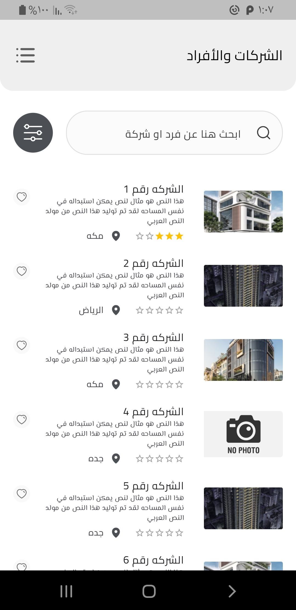
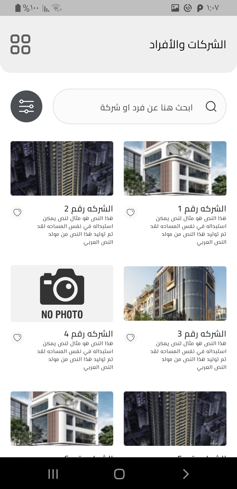
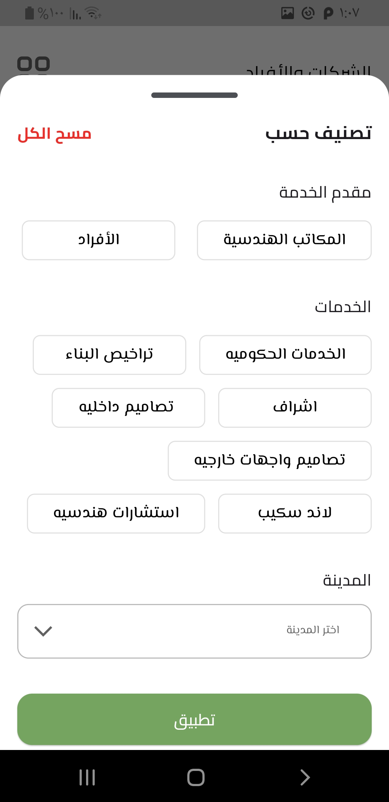
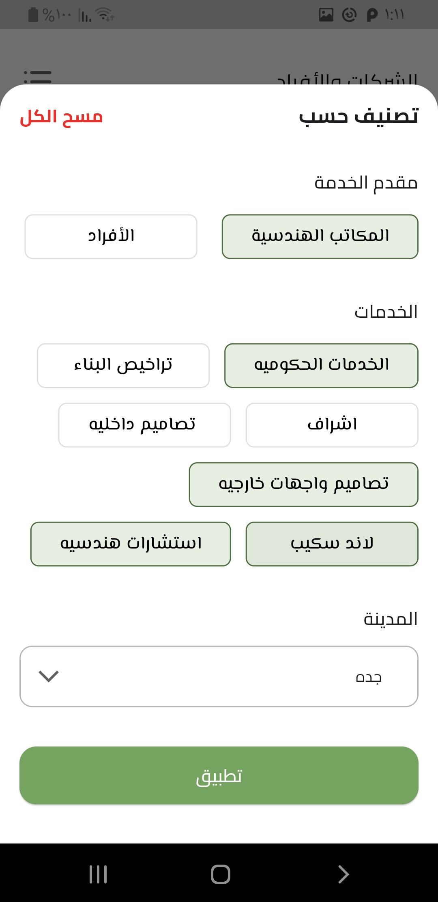
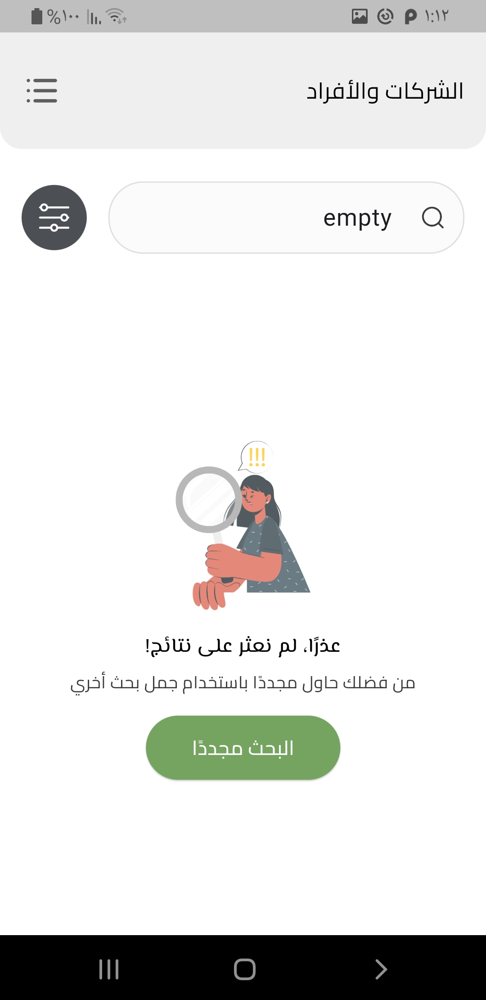
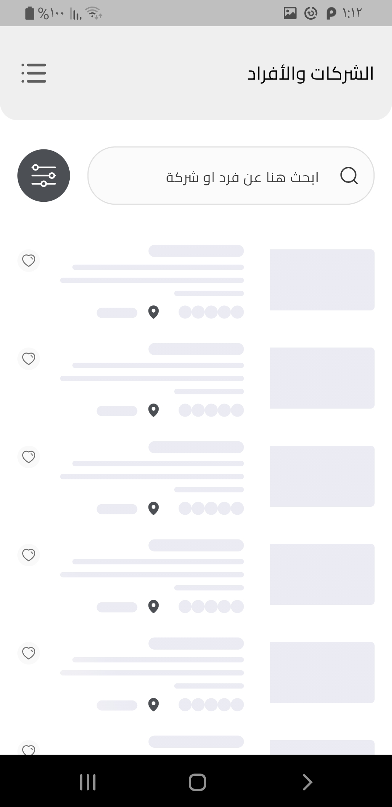
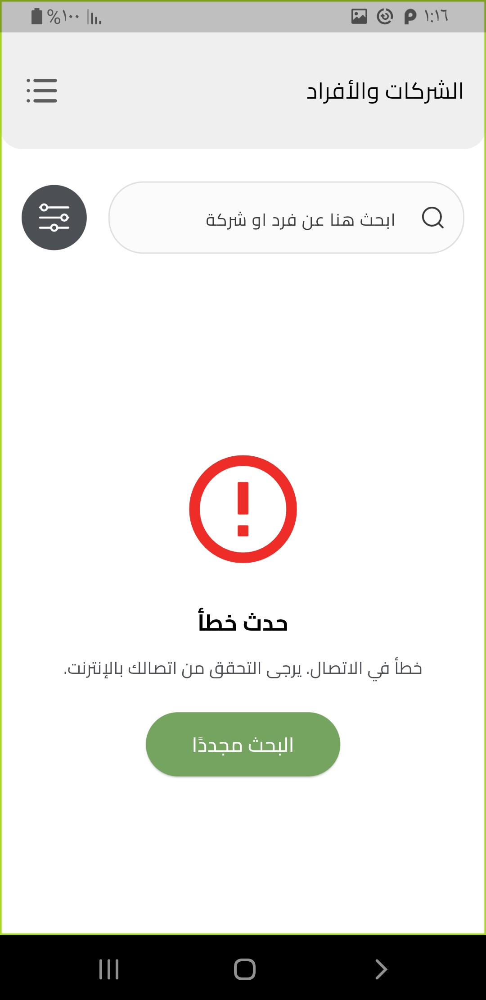
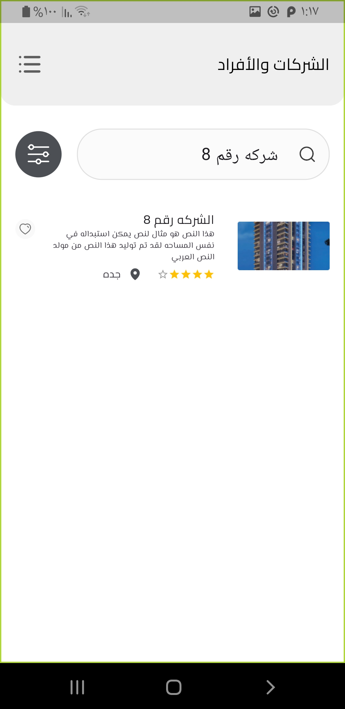

# 🏢 Link (Companies)

A Flutter mobile application for browsing and filtering companies and individuals with advanced search, filtering, and pagination capabilities.

## 📱 Screenshots

<div style="display: flex; flex-wrap: wrap; gap: 10px;">
  
  
  
  
  
  
  
  
</div>

---

## ✨ Features

### Core Functionality
- ✅ **Search**: Real-time search with 500ms debouncing
- ✅ **Advanced Filtering**:
  - Filter by provider type (Offices / Individuals)
  - Filter by city (dropdown selection)
  - Filter by services/subcategories (multiple selection)
  - Combine search with filters seamlessly
- ✅ **View Modes**: Toggle between List View and Grid View
- ✅ **Favorites**: Local favorite system (UI-only, no backend persistence)
- ✅ **Pagination**: Infinite scroll with load more functionality
- ✅ **Empty State**: Beautiful empty state when no results found
- ✅ **Error Handling**: Comprehensive error handling with retry option
- ✅ **Loading States**: Skeleton loading for better UX

### UX Enhancements
- Auto-dismiss keyboard when scrolling
- Smooth pagination (loads at 90% scroll)
- Prevents duplicate loading when scrolling up
- Filter selections are remembered when reopening filter sheet
- Keyboard-friendly empty and error states

---

## 🏗️ Architecture

This project follows **Clean Architecture** principles with clear separation of concerns:

```
lib/
├── core/
│   ├── constants/          # App-wide constants (assets)
│   ├── errors/             # Error handling (failures, exceptions, mappers)
│   ├── networking/         # API configuration (Dio setup, endpoints)
│   ├── theme/              # App theme (colors, text styles)
│   └── utils/              # Utilities (service locator, bloc observer)
│
└── features/
    └── companies/
        ├── data/
        │   ├── datasource/      # Remote data source implementation
        │   ├── models/          # Data models with JSON serialization
        │   └── repo/            # Repository implementation
        │
        ├── domain/
        │   ├── entities/        # Business entities
        │   ├── repo/            # Repository interfaces
        │   └── usecases/        # Business logic use cases
        │
        └── presentation/
            ├── manager/         # State management (Cubit)
            └── views/           # UI components and screens
```

### Architecture Layers

#### 1. **Presentation Layer**
- **State Management**: Flutter Bloc (Cubit)
- **UI Components**: Reusable custom widgets
- **Screens**: Home view with responsive design

#### 2. **Domain Layer**
- **Entities**: Pure Dart classes representing business models
- **Repository Interfaces**: Abstract contracts for data operations
- **Use Cases**: Single-responsibility business logic operations
  - `GetCitiesUseCase`
  - `GetSubcategoriesUseCase`
  - `FilterCompaniesUseCase`

#### 3. **Data Layer**
- **Models**: Data transfer objects with JSON serialization
- **Data Sources**: API communication layer
- **Repository Implementation**: Concrete implementation of domain contracts
- **Error Handling**: Exception to Failure mapping using Either pattern

---

## 🔧 Technical Stack

### Core Dependencies
```yaml
flutter_bloc: ^9.1.1              # State management
dio: ^5.9.0                       # HTTP client
dartz: ^0.10.1                    # Functional programming (Either)
get_it: ^9.1.0                    # Dependency injection
equatable: ^2.0.7                 # Value equality
```

### UI Dependencies
```yaml
flutter_screenutil: ^5.9.3        # Responsive design
google_fonts: ^6.3.2              # Custom fonts (Cairo, El Messiri)
flutter_svg: ^2.2.3               # SVG support
cached_network_image: ^3.4.1      # Image caching
skeletonizer: ^2.1.0+1            # Skeleton loading
```

---

## 🚀 Getting Started

### Prerequisites
- Flutter SDK: 3.38.3
- Dart SDK: 3.10.1
- Android Studio / VS Code with Flutter extensions

### Installation

1. **Clone the repository**
```bash
git clone <https://github.com/AliKamar34/link>
cd link_task
```

2. **Install dependencies**
```bash
flutter pub get
```

3. **Run the app**
```bash
flutter run
```

### Build APK
```bash
# Debug APK
flutter build apk --debug

# Release APK
flutter build apk --release
```

The APK will be generated in: `build/app/outputs/flutter-apk/`

---

## 🌐 API Integration

### Base URL
```
https://olivedrab-manatee-515331.hostingersite.com/api
```

### Endpoints

#### 1. Get Cities
```http
GET /cities
Headers: Accept-Language: ar
```

#### 2. Get Subcategories
```http
GET /sub-categoreis
Headers: Accept-Language: ar
```

#### 3. Filter Companies (with Pagination)
```http
POST /filter-companies
Content-Type: multipart/form-data
Headers: Accept-Language: ar

Parameters:
- search: string (optional)
- type: "office" | "person" (optional)
- city_id: int (optional)
- sub_categories: JSON array of {id: int} (optional)
- page: int (default: 1)
```

---

## 🎨 Design Patterns Used

### 1. **Repository Pattern**
Abstracts data sources from business logic
```dart
abstract class CompaniesRepo {
  Future<Either<Failure, List<City>>> getCities();
  Future<Either<Failure, List<Subcategory>>> getSubcategories();
  Future<Either<Failure, (List<Company>, Pagination)>> filterCompanies(...);
}
```

### 2. **Dependency Injection**
Using GetIt for loose coupling
```dart
void setupServiceLocator() {
  sl.registerLazySingleton(() => DioHelper());
  sl.registerLazySingleton<CompaniesRepo>(() => CompaniesRepoImpl(sl()));
  sl.registerFactory(() => CompaniesCubit(...));
}
```

### 3. **Either Pattern (Functional Error Handling)**
```dart
Future<Either<Failure, List<City>>> getCities() async {
  try {
    final cities = await _remoteDataSource.getCities();
    return Right(cities);
  } on ServerException catch (e) {
    return Left(ServerFailure(e.message));
  }
}
```

### 4. **State Management (BLoC/Cubit)**
```dart
sealed class CompaniesState extends Equatable {
  const CompaniesState();
}

class CompaniesLoading extends CompaniesState {}
class CompaniesLoaded extends CompaniesState { ... }
class CompaniesError extends CompaniesState { ... }
class CompaniesEmpty extends CompaniesState { ... }
class CompaniesLoadingMore extends CompaniesState { ... }
```

---

## 📦 Key Features Implementation

### 1. Search with Debouncing
```dart
onChanged: (value) {
  Future.delayed(const Duration(milliseconds: 500), () {
    if (_searchController.text == value && context.mounted) {
      context.read<CompaniesCubit>().search(value);
    }
  });
}
```

### 2. Pagination with Scroll Detection
```dart
void _onScroll() {
  final isScrollingDown = _scrollController.position.userScrollDirection 
      == ScrollDirection.reverse;
  
  if (isScrollingDown && _isBottom && hasMore && !isLoadingMore) {
    widget.onLoadMore?.call();
  }
}
```

### 3. Filter Persistence
Filters are stored in Cubit state and reapplied when:
- Performing a search
- Loading more pages
- Reopening filter sheet

### 4. Favorite Toggle (Local)
```dart
void toggleFavorite(int companyId) {
  if (favIds.contains(companyId)) {
    favIds.remove(companyId);
  } else {
    favIds.add(companyId);
  }
  // Update UI with new favorite status
}
```

---

## 🧪 Testing

The app includes comprehensive error handling for:
- Network timeouts
- Connection errors
- Server errors
- Empty results
- Pagination errors

### Error States
- `CompaniesError`: Shows error message with retry button
- `CompaniesEmpty`: Shows empty state with search again option
- Pagination errors: Maintains current list without showing error screen

---

## 📱 Localization

- **Primary Language**: Arabic (ar)
- **RTL Support**: Full right-to-left layout support
- **Fonts**: 
  - Cairo (primary)
  - El Messiri (secondary)

---

## 🎯 Performance Optimizations

1. **Image Caching**: Using `cached_network_image`
2. **Debounced Search**: Reduces API calls
3. **Pagination**: Loads data incrementally
4. **Lazy Loading**: Dependencies registered lazily with GetIt
5. **Keyboard Dismissal**: Auto-dismisses on scroll
6. **Efficient Rebuilds**: Using Equatable for state comparison

---

## 📋 Project Structure Highlights

### Separation of Concerns
- ✅ Business logic separate from UI
- ✅ Data layer separate from domain
- ✅ Easy to test and maintain
- ✅ Scalable architecture

### Code Quality
- ✅ Consistent naming conventions
- ✅ Proper error handling throughout
- ✅ Reusable custom widgets
- ✅ Clean and readable code

---

## 👨‍💻 Development Notes

### State Flow
```
CompaniesInitial 
    ↓
CompaniesLoading (loading filters + initial data)
    ↓
CompaniesLoaded (data displayed)
    ↓
CompaniesLoadingMore (loading next page)
    ↓
CompaniesLoaded (updated with more data)
```

### Filter + Search Flow
```
User enters search → Cubit stores search term
User applies filter → Filter combines with stored search
Result: Filtered + Searched companies
```

---
